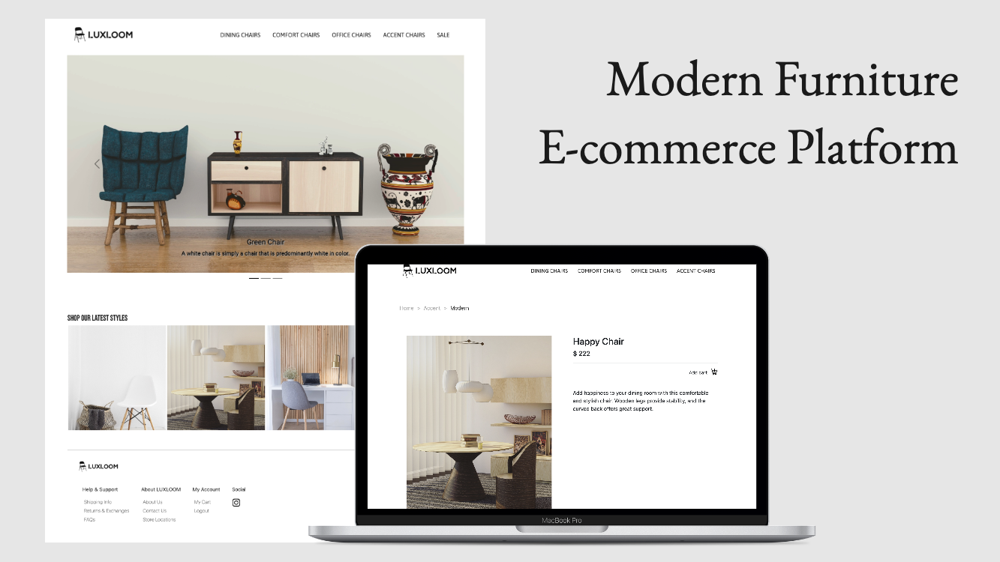
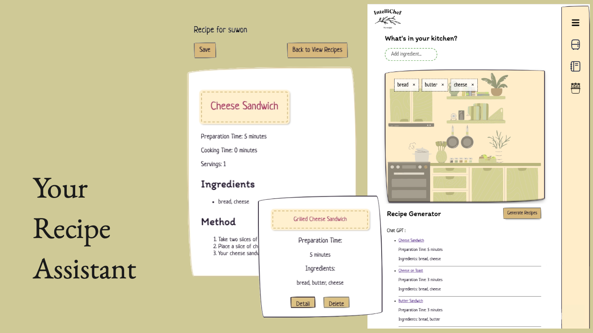

# integer-1
Here is
<a href="https://integer-1.github.io/">my Portfolio</a>

## About
Hi, I am Suwon, a Business-savvy software developer seasoned in business analysis and brand management, proficient in modern web technologies and enthusiastic about crafting innovative solutions.

## Skills

  
  
  
  
  
  
  
  
  
  
  

## Project

### Luxroom
#### Oct 2023 - Current

User-friendly web platform for buying chairs, featuring an intuitive interface to explore and purchase products, view detailed descriptions, and easily manage shopping carts for logged-in users
#### skill : TypeScript · JavaScript · React.js · SQLite · Express.js · Knex.js · Docker · CSS · HTML5 · Node.js
Project <a href="https://luxloom.pushed.nz/">View >> </a>  
GitHub Code <a href="https://github.com/integer-1/furniture-website-project">View >></a>

  

### IntelliChef (Group Project)
#### Nov 2023

Designed to help you decide what to cook based on the ingredients you have in your kitchen. It utilizes the ChatGPT API and React to provide a seamless experience in generating, saving, and managing recipes.
#### skill :TypeScript · JavaScript · React.js · SQLite · Express.js · Knex.js · Docker · CSS · HTML5 · Node.js

Project <a href="https://intelli-chef.pushed.nz/">View >> </a>  

  

<!-- ### ArcadePulse (in development)
#### Dec 2023 - Current

Discover a handpicked selection of games to keep you entertained during busy or dull moments. Dive in for a quick mental boost and enjoy the pulse of ArcadePulse!

#### skill : JavaScript · Matter.js · HTML5 · Vite· Node.js

 -->

## Contact me
### Suwon Jeong
    Email: integer.won@gmail.com  
    GitHub: [integer-1](https://github.com/integer-1)

    